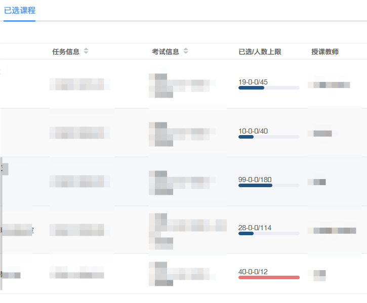

# 在复旦本科选课系统网站「已选课程」中显示课程余量

[在油叉中查看](https://greasyfork.org/zh-CN/scripts/536108-%E6%98%BE%E7%A4%BA%E8%AF%BE%E7%A8%8B%E4%BD%99%E9%87%8F)

注：会将「是否含A+成绩」该列替换为课程余量，有查看该列需求时请关闭脚本后刷新

## 使用

### 安装

- 在浏览器中安装「篡改猴」（Tampermonkey）拓展

- 点击此网站上的「安装此脚本」，在弹出的拓展网页中点击「安装」

### 运行

- 在选课系统网站中单击「已选课程」，切换到已选课程界面，脚本会自动运行并获取余量数据

- 已在「已选课程」界面时点击「已选课程」，会刷新余量数据

- 余量数据格式为`[数字]-[数字]-[数字]`，第一个数字为余量，后两个暂不清楚，可能是公选名额之类的

